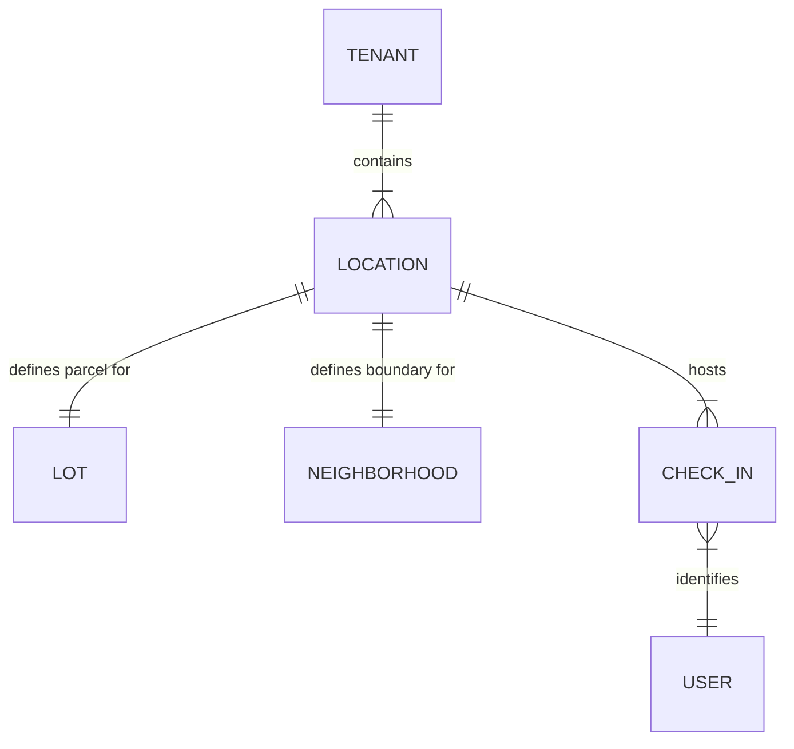

# Map System: Data Model

The Community Map is built on a specialized geographical schema that bridges physical geometry with logical community entities.

## Core Schema

### Locations (`locations`)
The primary table for all spatial features.
- `id`: UUID (Primary Key).
- `tenant_id`: UUID (Foreign Key to `tenants`).
- `name`: String.
- `type`: Enum (`facility`, `lot`, `walking_path`, `neighborhood`, `boundary`).
- `coordinates`: Point (WGS84).
- `boundary_coordinates`: Polygon (Array of coordinates).
- `path_coordinates`: LineString (Array of coordinates).
- `color`: Hex code for visual overrides.
- `metadata`: JSONB (Stores type-specific fields like `capacity`, `surface`, etc.).

### Relationships
- **Lots**: `lots.location_id` links a physical parcel to the `locations` table.
- **Neighborhoods**: `neighborhoods.location_id` links a logical boundary to the map.
- **Check-ins**: `check_ins.location_id` tracks resident presence at a specific map feature.

## Spatial Logic

### Centroid Calculation
For non-point locations (Lots, Facilities), the application calculates a **Centroid** using `@turf/centroid`. This is used for:
- Anchoring labels.
- Triggering "Fly-to" animations.
- Positioning Check-in beacons.

### Intersection & Bounds
The system uses `@turf/boolean-point-in-polygon` for:
- Validating if a new point is within community boundaries.
- Resolving address lookups to physical lots.

## Relationship Diagram

