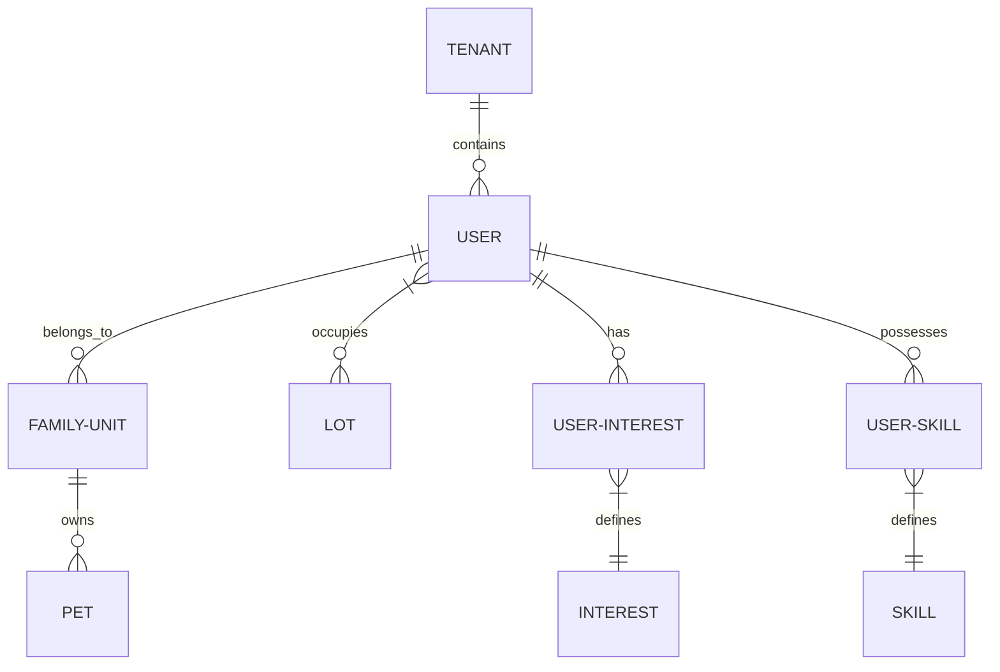

# Data Model: Profiles & Households

This document defines the underlying database schema and relationships for residents, pets, households, and access requests.

---

## Core Schema

The profile system spans several key tables in the `public` schema.

### Users Table (`users`)
Stores both authentication-capable residents and **Passive Accounts**.

| Column | Type | Description |
| :--- | :--- | :--- |
| `id` | `uuid` | Primary Key. |
| `email` | `text` | Nullable. If null, the account is **Passive**. |
| `role` | `role_type` | `resident`, `concierge`, or `admin`. |
| `lot_id` | `uuid` | Foreign Key to `lots`. Managed at the Resident level. |
| `family_unit_id` | `uuid` | Foreign Key to `family_units`. |
| `journey_stage` | `enum` | `planning`, `building`, `arriving`, `integrating`. |
| `privacy_settings` | `jsonb` | Visibility toggles for personal/contact fields. |
| `hero_photo_url` | `text` | Primary profile picture URL. |
| `gallery_urls` | `text[]` | Array of URLs for the resident's photo gallery. |

### Family Units (`family_units`)
Represents a structural household grouping.

- `id`: Unique identifier.
- `name`: Display name (e.g., "The Smith Family").
- `primary_contact_id`: FK to `users`. Mandatory invariant.
- `description`: Shared household blurb.
- `banner_url`: Shared household banner image.

### Many-to-Many Relationships
- **Interests**: `user_interests` join table linking `users` to `interests`.
- **Skills**: `user_skills` join table linking `users` to `skills`, including an `open_to_help` boolean flag.

### Access Requests (`access_requests`)
Vetting queue for potential new residents.

- `status`: `pending`, `approved`, or `rejected`.
- `prefill_data`: JSONB containing `name`, `email`, and `lot_preference`.

---

## Logical Relationships

---

## Technical Invariants
1. **Lot Assignment**: Lot mapping is stored on the `users` table. Changing a household's lot requires a batch update of all members.
2. **Passive Accounts**: Identified by the absence of an `email`. These accounts exist in `public.users` but not in `auth.users`, preventing login while maintaining directory presence.
3. **Complaints Count**: Derived via a join to the `requests` table where `tagged_entity_id` matches the user or pet ID.
