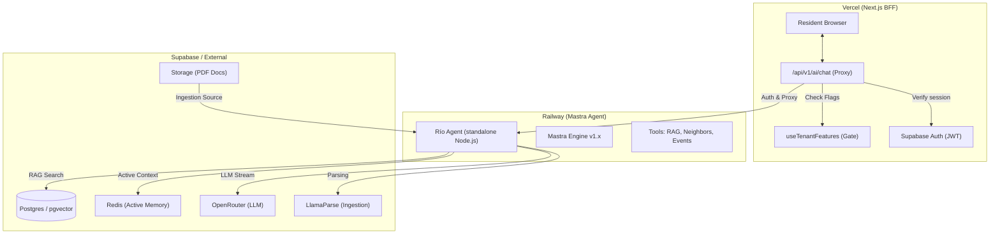
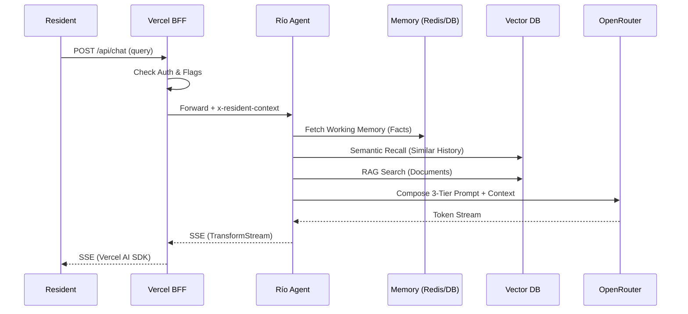

# Solution Architecture: Rio AI Agent

This document outlines the end-to-end architecture of the Río AI Assistant, covering its infrastructure topology, security boundaries, and data flow.

## System Topology

Río follows a "Backend-First" proxy architecture to ensure security, enforce platform-wide feature flags, and prevent LLM timeouts in serverless environments.

### Key Components

1.  **BFF Proxy**: A Next.js API route that handles authentication and injects resident profile context (`Tier 3`) into the agent's system prompt via the `x-resident-context` header.
2.  **Mastra Agent**: A dedicated service running on Railway to avoid Vercel's execution limits. It manages the long-running LLM streams and tool executions.
3.  **Tenant Isolation**: Enforced via `tenant_id` at the database level (RLS) and namespaced keys in Redis.

---

## RAG & Memory Flow

Río uses a 3-layer memory architecture to provide contextually aware responses while maintaining privacy.

### 3-Tier Prompt Strategy

Río dynamically composes its system prompt for every request to balance global standards with local community context and resident personalization.

1.  **Tier 1: Global Instruction (Base)**: Hardcoded in `rio-agent.ts`. Contains safety rails, persona basics (friendly neighbor), and citation requirements.
2.  **Tier 2: Community Context (Tenant)**: Fetched from `public.rio_configurations` via `supabaseAdmin`. Includes:
    - `prompt_persona`: Custom tone or character details.
    - `community_policies`: Local rules (e.g., quiet hours, trash pickup).
    - `emergency_contacts`: Specific local numbers.
    - `sign_off_message`: Mandatory concluding phrase.
3.  **Tier 3: Resident Context (Personalization)**: Injected via the `x-resident-context` header (Base64 encoded). This layer makes Río "user-aware" by providing a snapshot of the resident's profile and preferences.

#### Resident Profile Ingestion Details
For every chat session initiated in the BFF, the system fetches the resident's data to construct the Tier 3 context:
- **Identity**: `first_name`, `last_name`.
- **Background**: `about` (Bio), `current_country`.
- **Communication**: `preferred_language`, `languages` (Spoken).
- **Interests & Skills**: Aggregated from `user_interests` and `user_skills` tables.

**Security Pattern**: This context is Base64 encoded before being sent as a header to the Railway agent. This prevents interception of PII in transit logs and ensures the agent receives a clean, structured string for prompt injection.

---

## Memory & State Persistence

Río uses a hybrid memory model to ensure persistence even when thread context is lost or framework-level state is cleared.

### 3-Layer Memory Model
- **In-Session**: Postgres-backed message history (last 10 turns).
- **Working Memory**: Consolidation of resident facts. Uses a **SQL Fallback** to `public.mastra_resources` to prevent "stranded" memories.
- **Semantic Recall**: PgVector similarity search (threshold: 0.75) over past conversation fragments.

### Security & Privacy
- **RLS Initialization**: Every database connection in the pool is initialized with `set_config('app.current_tenant', ...)` and `set_config('app.current_user', ...)` before execution to prevent data leakage.
- **Durable Pruning**: Fact deletion triggers regex-based redaction in `mastra_messages` and vector deletion in `memory_messages`.
