# Río AI Agent: Background Ingestion

The Río AI Agent uses an asynchronous background pipeline to process community documents for RAG (Retrieval-Augmented Generation).

## Ingestion Workflow

When a Tenant Admin uploads or links a community document, the following sequence is triggered:

```mermaid
sequenceDiagram
    participant Admin as Tenant Admin
    participant BFF as Vercel BFF
    participant Agent as Railway Agent
    participant DB as Supabase (PgVector)
    
    Admin->>BFF: Ingest Request (/api/v1/ai/ingest)
    BFF->>Agent: Trigger Ingestion Step
    BFF-->>Admin: Returns "pending" (Immediate)
    
    rect rgb(30, 30, 30)
    Note over Agent: Processing Phase
    Agent->>Agent: LlamaParse (Chunking)
    Agent->>Agent: Embedding (Vectorization)
    Agent->>DB: Upsert Vectors (cosine similarity)
    Agent->>DB: Update status to "completed" in rio_documents
    end
```

## Implementation Details

### 1. Parsing Tier
Río utilizes **LlamaParse** for high-accuracy document parsing. This allows the agent to understand complex PDF structures, tables, and hierarchical community regulations better than standard text extraction.

### 2. Vectorization Tier
- **Model**: `text-embedding-3-small` (OpenAI).
- **Storage**: `public.memory_messages` using the `pgvector` extension.
- **Index Type**: HNSW (Hierarchical Navigable Small World) for sub-millisecond retrieval.

### 3. Error Handling
If an ingestion fails (due to file size limits or parsing timeouts), the status is updated to `error` in the `rio_documents` table, and the specific error message is captured for admin visibility in the dashboard.

## Monitoring

Admins can monitor the progress of ingestion via the **Río AI Admin Dashboard**. The dashboard polls the `rio_documents` table to provide real-time feedback on "Pending" vs "Completed" files.
