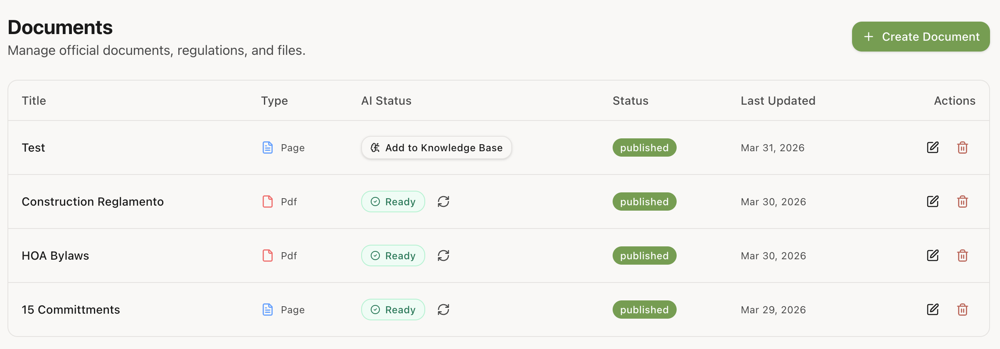
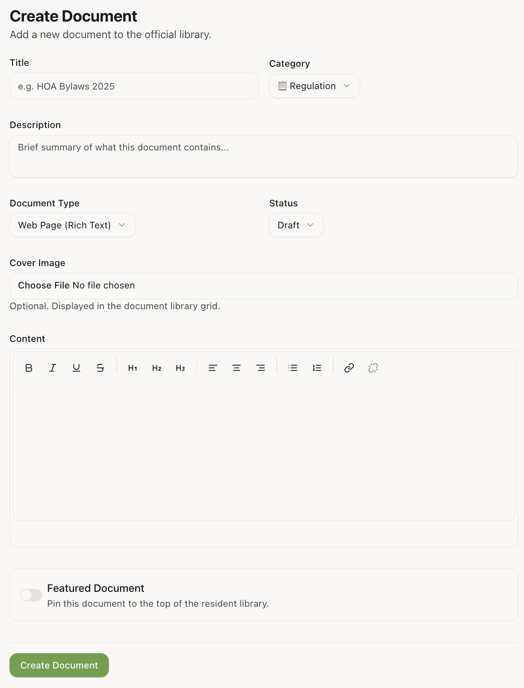

# Official Documents Management

The **Official Documents** module allows administrators to maintain a permanent repository of community resources, bylaws, and guides. Unlike [Announcements](./announcements.md), which are generally for news and temporary updates, Documents serve as the authoritative "Knowledge Base" for your community.

## The Documents Archive

Access the management table at `/admin/documents`. Here you can see all existing resources, their current status, and their AI indexing state.

### Key Columns & Categories:
- **Categories**:
  - `Rules & Regulations`: Governing documents and community-wide rules.
  - `Financial Reports`: Budgets, audits, and financial statements.
  - `Construction`: Maintenance schedules and building project updates.
  - `HOA Documents`: Meeting minutes, bylaws, and core organizational files.
- **Type**: Indicates if the document is a rich-text **Page** or a **PDF** upload.
- **AI Status**: Shows if the document has been ingested into Río's brain (see [AI Indexing](#ai-indexing) below).

---

## Archiving & Lifecycle

Unlike [Announcements](./announcements.md), which can be set to **Auto-Archive** on a specific date, **Official Documents** are intended to be permanent resources.

- **Manual Archive**: If a document becomes outdated (e.g., a 2024 budget), move it to the `Archived` status. This hides it from the default resident view while keeping it in the digital records.
- **Auto-Archive (Announcements Only)**: Use the [Announcements module](./announcements.md) for time-sensitive notices that should disappear automatically.

## Creating a New Document

Click **"Create Document"** to open the editor.

### 1. Choose Document Type
- **Page (Rich Text)**: Use the built-in editor to create formatted content directly in the app. This is indexed easily by search and AI.
- **PDF (File Upload)**: Upload an existing document. Residents will be able to view it in an integrated viewer and download it.

### 2. Visibility & Categories
- **Featured**: Pins the document to the top of the Resident dashboard.
- **Category**: Helps residents filter documents in the archive.
- **Status**: Keep documents as `Draft` while editing. Switch to `Published` to make them visible to residents.

---

## AI Indexing

Official documents are the primary source of truth for the **Río AI Assistant**. Once published, you can [ingest these records into Río's knowledge base](./rio/document-ingestion.md) to make them searchable via AI:

1. Ensure the status is set to `Published`.
2. In the Admin Table, click **"Add to knowledge base"** (or "Re-index" if the document content has changed).
3. Wait for the status badge to turn green (✅ Ready).

Once indexed, residents can ask Río questions like *"What are the parking rules?"* and Río will cite the document in its response.
