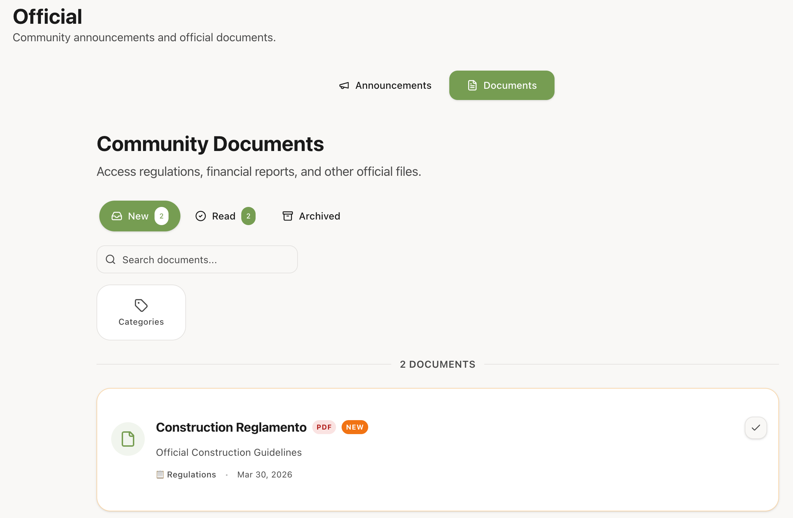
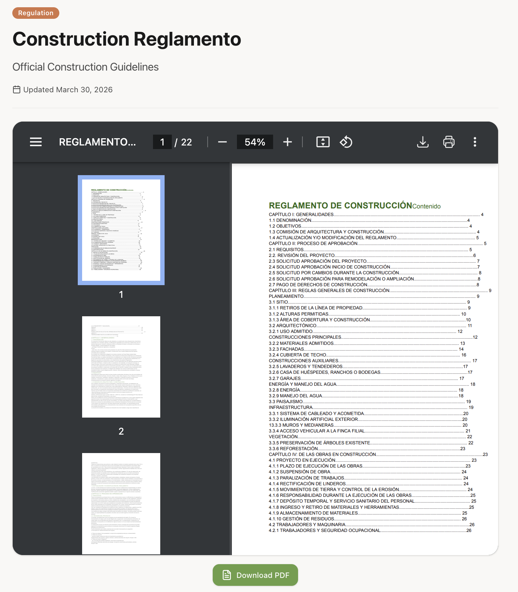
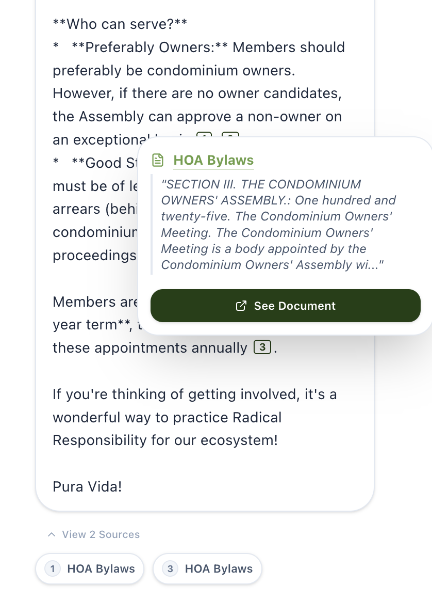

# Accessing Community Documents

The **Official Documents** section is your community's central library for rules, bylaws, manuals, and important resources.

## Document Status: New vs Read

Keeping track of community updates is easy with visual status indicators:

- **"New" Badge**: Appears on any document you haven't opened yet.
- **Status Reset**: If an administrator updates a document (e.g., a new version of the pool rules), its status is automatically reset to **"New"** for all residents, even if you read the previous version.
- **Read Logic**: Simply opening the document page marks it as read.

---

## Accessing Documents

You can find all official community content in the "Official" tab of your dashboard.

Documents are organized by category and date. Items marked as **Featured** will always appear at the top for easy access.

---

## Viewing a Document

Click on any document title to open it.

- **Read Tracking**: As soon as you open a document, it will be marked as "Read" for your account. This helps you keep track of new information you haven't seen yet.
- **PDF Documents**: If a document is a PDF, you can read it directly in the browser using the integrated viewer or click the **Download** button to save a copy.

---

## Asking Río about Documents

You don't always have to search the archive manually. When [chatting with Río](./rio/chat-basics.md), the assistant will automatically search through all published community documents to find the answers you need.

If you have a question about community rules or procedures, just ask Río! When Río uses an official document to answer you, it will provide a **Citation** link.

Clicking the citation number (e.g., `[1]`) will take you directly to the source document so you can verify the details yourself.

:::tip
Try asking: *"Where can I find the swimming pool rules?"* or *"How do I submit a maintenance request?"*
:::
