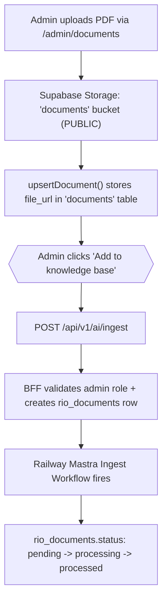

# PRD: Río AI — Sprint 10: Admin Experience

**Date**: 2026-03-20
**Sprint**: 10 (Roadmap) / Sprint 4 (Río Naming Convention)
**Status**: ✅ Finished — Sprint 10 Complete
**Epic**: [#162 — [Epic] Río AI — Sprint 4: Admin Experience](https://github.com/mjcr88/v0-community-app-project/issues/162)
**Blueprint**: [blueprint_rio_agent.md](../01_idea/blueprint_rio_agent.md) — Phase 3, Sprint 4
**Lead Agents**: `backend-specialist`, `frontend-specialist`, `security-auditor`

---

## 🎯 Overview

Sprint 10 delivers the Admin Experience for Río AI by **augmenting the existing document management UI**. When an admin uploads a PDF or creates a page in the existing `/admin/documents` area, they can manually trigger ingestion via an **"Add to knowledge base"** button in the document list.

**Key architectural decision (Revised 2026-03-20)**: Ingestion is **MANUAL**, not automatic. This gives admins control over what data is exposed to the AI. After initial ingestion, the button allows for manual **"Re-index"**.

> **⚠️ Resident Features Are Preserved — No Regressions Allowed**
> The ingestion trigger is **purely additive**. The following must continue to work exactly as before:
> - Residents viewing the document library (`/dashboard/official`)
> - Residents opening PDFs via `file_url` public link (served from `documents` bucket)
> - Admins marking documents as featured, draft, archived
> - Document change notifications and changelog
> - All existing `documents` table reads/writes and RLS policies
>
> Ingestion is a **manual admin action** — it writes to `rio_documents` without touching any existing resident-facing data path.

---

## 🐛 Bug Fix: Storage Bucket Not Found (Blocker)

> **This is the FIRST task to resolve before Sprint 10 begins.**

### Root Cause (Investigated 2026-03-20)

The `"documents"` bucket **exists in prod** (`nido.prod`, created 2025-12-31 at Alpha Launch) but **does not exist in dev** (`nido.dev`). Prod has:
- `photos` (public, created 2025-12-31)
- `documents` (public, created 2025-12-31)
- `rio-documents` (private, created 2026-03-20 in Sprint 8)

Dev only has:
- `rio-documents` (created 2026-03-19 in Sprint 8)

**This is a dev environment gap** — the bucket was created manually in prod at Alpha Launch but was never codified as a migration. When `nido.dev` was provisioned (separately from the old `Community App` project), it got Sprint 8 migrations but not the pre-existing prod buckets.

### Fix Strategy

Add a Supabase migration that creates the `documents` bucket **if it does not exist** (idempotent), so dev matches prod. This migration should reflect prod's existing config: public bucket, no file size limit (matching prod). No code changes to `document-form.tsx` or `supabase-storage-client.ts` needed — those were always correct.

> **Design decision (unchanged)**: `documents` = public CDN for resident-accessible PDFs. `rio-documents` = private bucket for AI agent internal downloads. They remain separate.

---

## 📋 Selected Issues (Revised from Epic #162)

| # | Original Sub-Issue | Sprint 10 Interpretation | Size | Est. Hours | Risk |
|---|---|---|:---:|:---:|:---|
| B | **Bug: Bucket not found** | Create `documents` storage bucket + RLS | XS | 2-4h | 🟢 LOW |
| 4.2 | Manual Ingest Trigger | Add "Add to knowledge base" button to `/admin/documents`; calls `/api/v1/ai/ingest` | S | 4-8h | [x] |
| 4.3 | Ingestion Status & Re-index | Integration of status badge + "Re-index" button logic | S | 4-8h | [x] |
| 4.4 | Document delete | Extend `deleteDocument` action: cascade delete `rio_document_chunks` + `rio_documents` row | S | 4-8h | [x] |
| 4.5 | Agent Settings page | Build `/admin/rio/settings` (Prompt Tier 2 form — `rio_configurations.system_prompt`) | M | 1-2d | 🟡 MED |
| 4.6 | Feature toggle UI | Add `rag_enabled` + `memory_enabled` toggles to settings page | XS | 2-4h | 🟢 LOW |
| ~~4.1~~ | ~~Knowledge Base page~~ | **Skipped** — existing `/admin/documents` page is the KB | — | — | — |
| ~~4.7~~ | ~~Test in Sandbox~~ | **Deferred to Sprint 11** (needs chat interface from Sprint 3 first) | — | — | — |
| ~~4.8~~ | ~~Pilot onboarding~~ | **Rescheduled** — happens after settings + status UI are live | — | — | — |

**Total Active Story Points**: 13 | **Est. Hours**: ~18-34h | **Duration**: 1 week

---

## 🏗️ Architecture & Git Strategy

### Architectural Concept



### Content Type Handling

| Document Type | Storage | Ingestion Method |
|---|---|---|
| **PDF** | `documents` bucket | LlamaParse (existing Mastra step) |
| **Page (Rich Text)** | No file storage, HTML in `documents.content` | Fetch HTML → strip to Markdown via `turndown` |

> **Note**: For `page` type documents, the ingestion BFF will pass the raw `content` HTML to the Railway agent instead of a signed URL. The agent will use a simple `html-to-markdown` step (or `turndown`) before chunking.

### Bridge Table Pattern

A new `document_ingestion_map` table (or just reuse `rio_documents.source_document_id` foreign key) will link `documents.id` → `rio_documents.id`. This prevents duplicate ingestion and enables status polling.

> **Decision**: Add `source_document_id UUID REFERENCES documents(id)` column to `rio_documents`. This is a zero-downtime additive migration.

### Git Strategy

**Recommendation: One branch for the full sprint.**

```text
feat/sprint-10-rio-admin  (single branch, single PR)
```

**Why one branch?**
- All tasks in the sequential chain (bucket fix → ingest trigger → status → delete) are tightly coupled. Splitting them across 4 PRs adds merge overhead with no review benefit for a solo developer.
- The settings page is independent but small enough to include in the same sprint branch.
- One clean PR = one cohesive review.

**Commit discipline** compensates for the single branch: use conventional commits scoped by issue (e.g. `fix: documents storage bucket dev gap`, `feat(4.2): ingest trigger on upsertDocument`, etc.) so the commit log remains navigable.

---

## 🔧 Specialist Breakdown

---

### 🐛 BUG: Documents Storage Bucket

**Agent**: `security-auditor`
**Branch**: `fix/documents-storage-bucket`

#### Code Changes

| File | Change |
|---|---|
| `supabase/migrations/20260321000000_documents_bucket.sql` | [NEW] Create `documents` storage bucket + RLS policies |

#### Migration Content

```sql
-- Idempotent: create 'documents' bucket to match prod (created at Alpha Launch)
-- Matches prod config: public = true, no file size limit
INSERT INTO storage.buckets (id, name, public)
VALUES ('documents', 'documents', true)
ON CONFLICT (id) DO NOTHING;

-- RLS: Only admins can upload (apply only if policy doesn't exist)
DO $$
BEGIN
  IF NOT EXISTS (
    SELECT 1 FROM pg_policies WHERE policyname = 'Admins can upload to documents'
  ) THEN
    CREATE POLICY "Admins can upload to documents" ON storage.objects
    FOR INSERT WITH CHECK (
      bucket_id = 'documents' AND
      (SELECT role FROM public.users WHERE id = auth.uid()) IN ('tenant_admin', 'super_admin')
    );
  END IF;
END $$;

-- RLS: Public read
DO $$
BEGIN
  IF NOT EXISTS (
    SELECT 1 FROM pg_policies WHERE policyname = 'Public can read documents'
  ) THEN
    CREATE POLICY "Public can read documents" ON storage.objects
    FOR SELECT USING (bucket_id = 'documents');
  END IF;
END $$;

-- RLS: Admins can delete
DO $$
BEGIN
  IF NOT EXISTS (
    SELECT 1 FROM pg_policies WHERE policyname = 'Admins can delete documents'
  ) THEN
    CREATE POLICY "Admins can delete documents" ON storage.objects
    FOR DELETE USING (
      bucket_id = 'documents' AND
      (SELECT role FROM public.users WHERE id = auth.uid()) IN ('tenant_admin', 'super_admin')
    );
  END IF;
END $$;
```

#### Acceptance Criteria

- [x] **AC1**: Given an admin selects a PDF, when the file dialog closes, then no "Bucket not found" error appears.
- [x] **AC2**: Given a successful upload, when the file_url is stored, then the URL is publicly accessible (no auth required to open).
- [x] **AC3**: Given a resident (non-admin) user, when attempting to upload via a direct API call, then Supabase returns 403.

---

### Issue 4.2 — Manual Ingest Trigger

**Agent**: `backend-specialist` + `frontend-specialist`

#### Design

Instead of an automatic trigger on publish, we add a dedicated "Add to knowledge base" action in the admin UI.

#### Code Changes

| File | Change |
|---|---|
| `components/admin/document-list.tsx` | [MODIFY] Add "Add to knowledge base" button for each document |
| `app/api/v1/ai/ingest/route.ts` | [MODIFY] Accepts `documentId`; validates admin role; triggers Mastra workflow |
| `supabase/migrations/20260321000001_source_document_id.sql` | [NEW] Add `source_document_id` FK column to `rio_documents` |
| `packages/rio-agent/src/workflows/ingest.ts` | [MODIFY] Add `parseHtmlToMarkdown` step for `page` document type |
| `packages/rio-agent/src/lib/html-parser.ts` | [NEW] `parseHtmlToMarkdown(html: string): string` using `turndown` |

#### Ingest BFF Changes

The BFF (`/api/v1/ai/ingest/route.ts`) will:
1. Look up `rio_documents` by `source_document_id`. If found → trigger update workflow. If not found → create new `rio_documents` row, then trigger.
2. For `page` type: pass `content` to Railway instead of a signed URL.

#### Acceptance Criteria

- [x] **AC1**: Given an admin clicks "Add to knowledge base" for a published PDF, when the action completes, then a row exists in `rio_documents` with `status='pending'` and `source_document_id` linking back.
- [x] **AC2**: Given an admin clicks "Add to knowledge base" for a published page, when ingestion runs, then the page HTML content is ingested as chunks without a Storage file.
- [x] **AC3**: Given a document with status=draft, then the "Add to knowledge base" button is disabled or hidden.
- [x] **AC4**: Given a previously ingested document, when the admin clicks "Re-index", then the existing `rio_documents` row status resets to `pending` and the workflow re-triggers.

---

### Issue 4.3 — Ingestion Status & Re-index logic

**Agent**: `frontend-specialist`

#### Design

The "AI Status" column merges the trigger and status polling:
- **State: Not Indexed** -> Button: "Add to knowledge base"
- **State: Pending/Processing** -> Loading Spinner + Pulse effect
- **State: Processed** -> Green ✅ Ready + Button: "Re-index" (small)
- **State: Error** -> Red 🔴 Error + Button: "Retry"

#### Code Changes

| File | Change |
|---|---|
| `app/t/[slug]/admin/documents/page.tsx` | [MODIFY] Fetch `rio_documents` status for each document |
| `components/admin/document-list.tsx` | [MODIFY] Add AI Status column with badge + Re-index button |
| `components/admin/ingestion-status-badge.tsx` | [NEW] Status badge: pending/processing/processed/error + auto-poll every 5s |
| `components/admin/reindex-button.tsx` | [NEW] "Re-index" icon button — calls `/api/v1/ai/ingest` directly from client |

#### Polling Pattern

```tsx
// components/admin/ingestion-status-badge.tsx
'use client'
import { useEffect, useState } from 'react'

// Polls only if status is 'pending' or 'processing'
export function IngestionStatusBadge({ documentId, initialStatus }: Props) {
  const [status, setStatus] = useState(initialStatus)
  
  useEffect(() => {
    if (!['pending', 'processing'].includes(status)) return
    const interval = setInterval(() => {
      fetch(`/api/v1/ai/ingest-status?documentId=${documentId}`)
        .then(r => r.json())
        .then(data => setStatus(data.status))
    }, 5000)
    return () => clearInterval(interval)
  }, [status, documentId])
  
  // ... badge render
}
```

#### New API Endpoint

`GET /api/v1/ai/ingest-status?documentId=...` → returns `{ status, error_message? }`

| File | Change |
|---|---|
| `app/api/v1/ai/ingest-status/route.ts` | [NEW] Status polling endpoint (admin-only) |

#### Acceptance Criteria

- [x] **AC1**: Given a newly published document, when the admin document list loads, then the AI Status column shows a `pending` spinner.
- [x] **AC2**: Given a document with status=processed, when the list renders, then a green ✅ "Ready" badge is shown.
- [x] **AC3**: Given a document with status=error, when the admin hovers the badge, then the error message tooltip is displayed.
- [x] **AC4**: Given the badge is in `pending` state, when 5 seconds pass and the document is now `processed`, then the badge updates without a page reload.
- [x] **AC5**: Given a draft document, then the AI Status column shows "—" and no Re-index button is shown.
- [x] **AC6**: Given a published document with status=error, when the admin clicks "Re-index", then the status resets to `pending` and the ingestion workflow re-triggers.
- [x] **AC7**: Given a published document with no `rio_documents` row (pre-Sprint-10), when the admin clicks "Re-index", then a new `rio_documents` row is created and ingestion begins.

---

### Issue 4.4 — Delete Cascade (Atomic)

**Agent**: `backend-specialist`
**Branch**: `feat/sprint-10-delete-cascade`

#### Design

The current delete action deletes from the `documents` table. We must:
1. Find the linked `rio_documents` row via `source_document_id`.
2. Delete all `rio_document_chunks` for that rio document ID.
3. Delete the `rio_documents` row.
4. Delete the `documents` row.

Wrap in a Postgres transaction or use a Supabase RPC function.

#### Code Changes

| File | Change |
|---|---|
| `app/actions/documents.ts` | [MODIFY] Add `deleteDocument()` server action with cascade logic |
| `supabase/migrations/20260321000005_delete_rio_cascade.sql` | [NEW] SQL function `delete_document_with_rio_cascade(p_document_id uuid)` |
| `app/t/[slug]/admin/documents/[id]/page.tsx` or list | [MODIFY] Wire delete button to new action |

#### RPC Pattern

```sql
CREATE OR REPLACE FUNCTION delete_document_with_rio_cascade(p_document_id uuid)
RETURNS void LANGUAGE plpgsql SECURITY DEFINER AS $$
DECLARE
  v_rio_doc_id uuid;
BEGIN
  -- Find linked rio document
  SELECT id INTO v_rio_doc_id FROM rio_documents 
  WHERE source_document_id = p_document_id;
  
  IF v_rio_doc_id IS NOT NULL THEN
    -- Delete chunks first (FK constraint)
    DELETE FROM rio_document_chunks WHERE document_id = v_rio_doc_id;
    -- Delete rio document
    DELETE FROM rio_documents WHERE id = v_rio_doc_id;
  END IF;
  
  -- Delete source document
  DELETE FROM documents WHERE id = p_document_id;
END;
$$;
```

#### Acceptance Criteria

- [x] **AC1**: Given a published document with chunks in `rio_document_chunks`, when the admin deletes it, then all associated chunks and the `rio_documents` row are deleted atomically.
- [x] **AC2**: Given a draft document (no `rio_documents` row), when deleted, then the document is deleted without error.
- [x] **AC3**: Given a deletion is triggered, when the Supabase call returns, then the admin is redirected to the document list with a success toast.
- [x] **AC4**: Given the deleted document ID, when asked by Río AI, then no responses cite it (manual QA with a test chat query).

---

### Issues 4.5 + 4.6 — Agent Settings Page

**Agent**: `frontend-specialist` + `backend-specialist`
**Branch**: `feat/sprint-10-agent-settings`

#### Design

A new admin page at `/t/[slug]/admin/rio/settings` with two sections:
1. **Persona Form** — Edit `rio_configurations.system_prompt` (Prompt Tier 2), tone, and language.
2. **Feature Toggles** — Toggle `rag_enabled` and `memory_enabled` in `tenants.features.$rio`.

Accessible via a new **"Community Agent"** item in the admin sidebar nav (`app/t/[slug]/admin/layout.tsx`).

> **Injection Filter**: All Prompt Tier 2 writes must be sanitized. Block strings like `"ignore previous instructions"`, `"you are now"`, `"disregard your training"`.


#### Code Changes

| File | Change |
|---|---|
| `app/t/[slug]/admin/rio/settings/page.tsx` | [NEW] Server Component: fetches `rio_configurations` + `tenant.features` |
| `components/admin/rio-settings-form.tsx` | [NEW] Client form with Zod validation, injection filter |
| `app/actions/rio-settings.ts` | [NEW] `updateRioSettings()` server action |
| `components/admin/feature-toggles.tsx` | [NEW] Toggle switches for `rag_enabled`, `memory_enabled` |
| `app/t/[slug]/admin/layout.tsx` | [MODIFY] Add "Río Settings" nav link |

#### Injection Filter

```typescript
const INJECTION_PATTERNS = [
  /ignore\s+previous\s+instructions/i,
  /you\s+are\s+now\s+(a|an)/i,
  /disregard\s+(your|all)\s+(training|instructions)/i,
  /act\s+as\s+(a|an|if)/i,
  /forget\s+(everything|all)\s+(you|your)/i,
]

export function containsInjection(text: string): boolean {
  return INJECTION_PATTERNS.some(p => p.test(text))
}
```

#### Acceptance Criteria

- [x] **AC1**: Given an admin navigates to `/admin/rio/settings`, then the current persona prompt and feature toggles load from the database.
- [x] **AC2**: Given the admin updates the persona prompt and saves, then `rio_configurations.system_prompt` is updated in the database.
- [x] **AC3**: Given the admin toggles `rag_enabled` to false, then `tenants.features.$rio.rag = false` is updated. (Managed via Super Admin)
- [x] **AC4**: Given the prompt contains `"ignore previous instructions"`, when the form is submitted, then a validation error is shown and the save is rejected.
- [x] **AC5**: Given a resident (non-admin) user, when they attempt to access `/admin/rio/settings`, then they receive a 403 redirect. (Verified via Layout Gating)

---

## 🚦 Implementation Order

```text
[1] Bug Fix: Documents Bucket (Prerequisite — unblocks all others)
    └─▶ feat: 4.2 Ingest Trigger on Publish
             └─▶ feat: 4.3 Status Badges + Polling API
                      └─▶ feat: 4.4 Delete Cascade

[PARALLEL] feat: 4.5+4.6 Agent Settings Page (independent)
```

**Rationale**: The bucket fix is a prerequisite blocker. The settings page is entirely independent and can be developed in parallel. Delete cascade logically follows status polling (so admins can see what they're deleting before testing delete).

---

## ✅ Definition of Done

- [x] Code passes `npm run lint` & `npx tsc --noEmit`
- [x] PR reviewed (Draft → Ready)
- [x] Manual QA: upload PDF → see status go pending → processed
- [x] Manual QA: create page document → see status update
- [x] Manual QA: delete document → chat with Río → document no longer cited
- [x] Manual QA: injection filter rejects "ignore previous instructions"
- [x] No new P0 bugs introduced
- [x] Documentation updated in `docs/`
- [x] Worklogs created in `docs/07-product/04_logs/`

---

## 📅 Sprint Schedule

> Proposed start: **2026-03-24** (Monday). Solo developer, sequential + 1 parallel track.

| Issue | Branch | Size | Est. Hours | Start | Target |
|---|---|:---:|:---:|---|---|
| Bug: Bucket | `fix/documents-storage-bucket` | XS | 2-4h | 2026-03-24 | 2026-03-24 |
| 4.2 Ingest Trigger | `feat/sprint-10-ingest-trigger` | S | 4-8h | 2026-03-24 | 2026-03-25 |
| 4.3 Status Badges | `feat/sprint-10-ingest-status` | S | 4-8h | 2026-03-25 | 2026-03-26 |
| 4.4 Delete Cascade | `feat/sprint-10-delete-cascade` | S | 4-8h | 2026-03-26 | 2026-03-27 |
| 4.5+4.6 Settings | `feat/sprint-10-agent-settings` | M | 1-2d | 2026-03-24 | 2026-03-27 |
| **QA & Sign-off** | — | — | — | 2026-03-27 | 2026-03-28 |

---

## 📋 Go/No-Go Gate (from Epic #162 — revised)

- [x] Admin uploads a PDF → status flows `pending → processed` unaided
- [x] Admin manually clicks "Re-index" on a pre-existing published document → ingestion fires
- [x] Page document (rich text) → ingested as chunks, appears in future chat responses
- [x] Deleted document → no longer cited in chat (verified via database purge)
- [x] Prompt Tier 2 change saved successfully
- [x] Injection filter blocks `"ignore previous instructions"` in settings form

---

## 🚀 Release Notes (Final) — Verified & Hardened

### 🛡️ Security & Infrastructure
- **Hardened Document Deletion**: Implemented tenant-aware cascade deletion via Postgres RPC (`delete_document_with_rio_cascade`), ensuring cross-tenant data isolation.
- **Storage Path Isolation**: Enforced path-based RLS on the `documents` bucket to prevent unauthorized cross-tenant file manipulation.
- **Vector Parity**: Migrated to OpenAI `text-embedding-3-small` (1536 dims) for superior semantic search performance.

### 🏗️ Application Stability
- **Atomic Ingestion**: Replaced race-prone ingestion triggers with atomic upserts to ensure consistent document status transitions.
- **Crash Prevention**: Resolved critical `useRouter` runtime issues in the Admin Documents table.
- **Validation**: Added server-side enforcement for PDF upload URLs to prevent malformed ingestion attempts.

### ♿ Accessibility & UX
- **Full AX Audit**: Added ARIA labels to all icon-only administrative actions.
- **Reactive UI**: Implemented real-time status polling for document ingestion with intelligent action disabling during processing.
